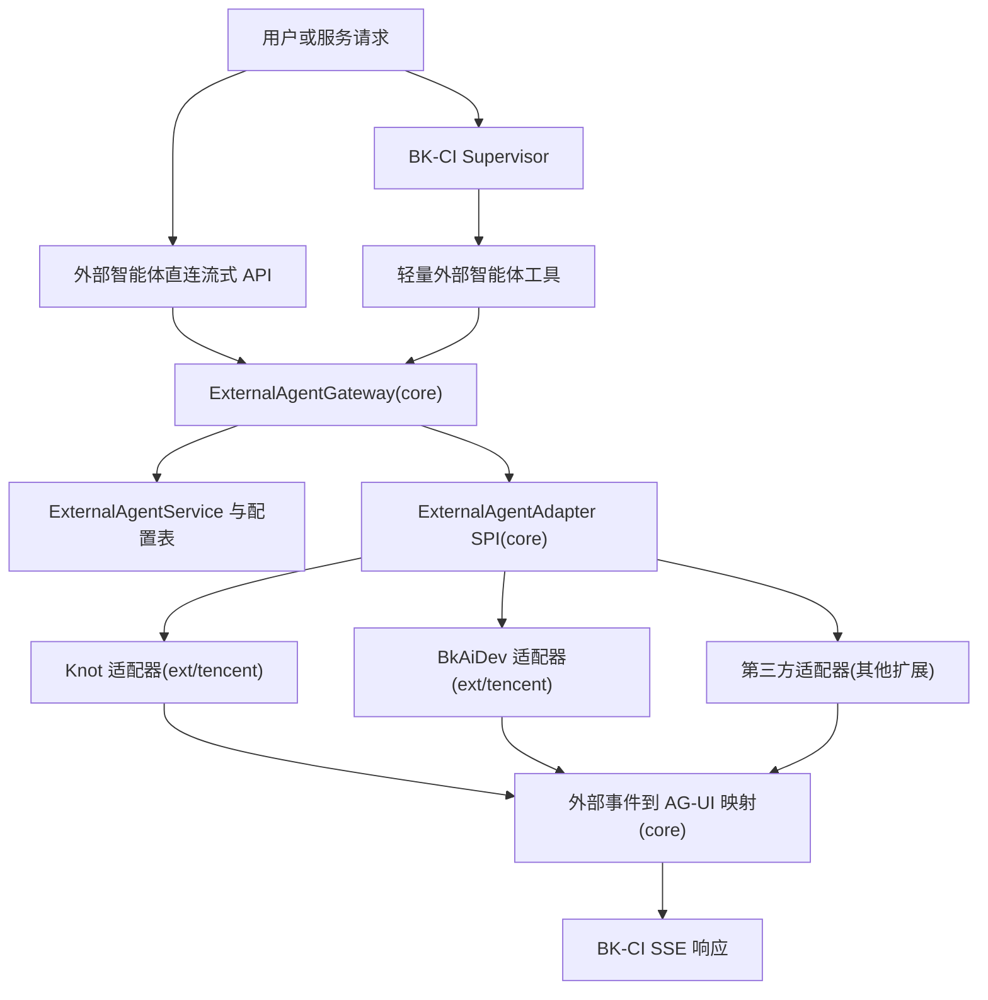
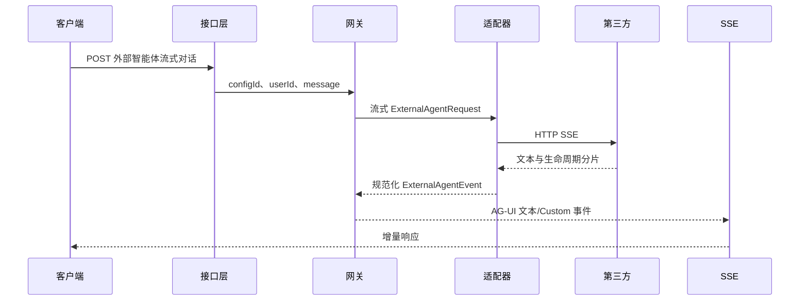
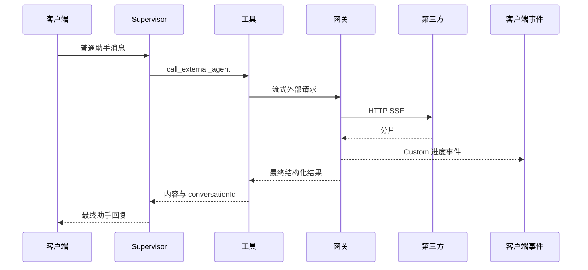

## 背景与现状

BK-CI 当前将第三方智能体建模为 `external_agent` 这一 ReActAgent 内部的工具。运行时由
`ExternalAgentSubAgentDefinition` 加载已启用的 `ExternalAgentInfo`，为每条配置注册一个
`ExternalAgentTool`，由调度智能体选择工具后，再经平台相关的 `ExternalAgentCaller` 发起 HTTP 调用。

该设计存在三个生产问题：

- 调度用 ReActAgent 在任意第三方 HTTP 请求开始前多消耗一轮 LLM。
- `ExternalAgentTool` 需等待 `caller.call()` 返回完整 `String` 后才返回 `ToolResultBlock`。
- `KnotAgentCaller` 使用非流式请求；`BkAiDevAgentCaller` 虽声明流式，仍用 `bodyToMono(String).block()`
  聚合整包响应。

主对话链路已具备流式事件管道：`AiChatService` 合并 AG-UI 事件与 `AgentSessionContext` 的 Custom 事件；
`SubAgentEventForwardingHook` 已演示如何将子智能体进度暴露给前端。外部智能体重构应复用该管道，而非另起一套流式机制。

## 目标 / 非目标

**目标：**

- 提供生产可用的外部智能体调用路径，尽量减少额外延迟。
- 在可行范围内保留现有外部智能体配置 API 与数据模型。
- 将第三方输出以 BK-CI 兼容 AG-UI 事件流式返回，而非等待完整响应。
- 同时支持直连外部智能体对话与可选的 Supervisor 路由委派。
- 通过 Knot、BkAiDev 及未来 AG-UI 兼容平台的适配器隔离协议差异。
- 明确超时、错误映射、可观测性与迁移边界。

**非目标：**

- 替换 BK-CI 主 Supervisor 架构。
- 构建通用多智能体编排引擎。
- 本变更内实现前端配置 CRUD 管理页（除非端到端验证必需）。
- 首期将存储密钥迁移到新凭据系统（仅定义边界，可分阶段实施）。
- 将当前调度子智能体路径作为长期生产主路径保留。
- 将 AIDev 的「蓝鲸插件调用」接口纳入流式主路径；该接口按文档不支持流式输出，只能作为后续非流式兼容能力。

## 技术决策

### 决策 1：以 `ExternalAgentGateway` 作为运行时入口

新运行时路径采用服务层网关：

```text
ExternalAgentGateway
  -> 配置加载与归属校验
  -> 平台适配器选择
  -> 流式 HTTP 调用
  -> 外部事件转换为 AG-UI 事件
```

**理由：**

- 目标外部智能体已确定时，无需再创建 ReActAgent。
- 集中处理超时、错误映射、日志、指标及后续限流。
- 直连 API 与 Supervisor 工具可共用同一网关。

**曾考虑的替代方案：**

- 仅将 Caller 改为流式，保留 `ExternalAgentSubAgentDefinition`：可改善首包可见性，但仍承担调度 LLM 一跳且路由不稳定。
- 将 `external_agent` 绑定到 Supervisor：主助手可调用，但链路更深，与本次降延迟目标相悖。

### 决策 2：区分直连与 Supervisor 路由两种模式

- **直连模式**：用户或服务显式选择某条外部智能体配置，经专用流式接口调用。
- **路由模式**：Supervisor 通过轻量工具（如 `call_external_agent`）直连 `ExternalAgentGateway`，不创建外部调度 ReActAgent。

**理由：**

- 直连延迟最低、行为最清晰，适合生产主路径。
- 路由模式保留「向主助手提问并由其委派」的体验。
- 两种模式共享网关与适配器，避免协议代码重复。

**曾考虑的替代方案：**

- 仅路由模式：入口统一，但显式使用外部智能体时必然多经 Supervisor，更慢。
- 仅直连模式：最快，但主助手无法委派。

### 决策 3：平台适配器采用流式契约

生产路径用流式适配器契约替代阻塞式 `ExternalAgentCaller.call(...): String`。示意：

```kotlin
interface ExternalAgentAdapter {
    fun platform(): String
    fun stream(request: ExternalAgentRequest): Flux<ExternalAgentEvent>
    fun call(request: ExternalAgentRequest): Mono<ExternalAgentResult>
}
```

`stream` 为生产主路径；`call` 可由收集 `stream` 实现，供同步调用方与测试使用。

适配器契约与网关骨架属于平台无关能力，落在 `core/ai`：

- 请求、事件、结果、错误分类等通用模型。
- `ExternalAgentGateway`、`ExternalAgentAdapter`、适配器选择与通用错误映射。
- 将规范化外部事件映射为 BK-CI AG-UI 事件的通用转换逻辑。
- 用户侧直连流式 API 及其与网关的服务层编排。

AIDev、Knot 均属于腾讯内部平台，具体实现必须落在 `ext/tencent/ai`：

- 平台常量、平台白名单、平台级必填 URL/header 校验。
- AIDev/Knot 请求体构造、鉴权 header 解析、HTTP SSE 调用。
- AIDev 标准 AG-UI SSE 与 Knot AG-UI 风格 SSE 的字段解析。
- 平台专属错误码、会话 id 字段、非流式接口识别与兼容策略。

**理由：**

- 流式必须在平台边界建模，不能事后再从聚合字符串还原。
- 各平台解析自有 SSE 形态，统一输出规范化事件。
- 网关可一致转换为 AG-UI 事件。
- `core/ai` 保持可复用的第三方外部智能体调用框架，避免沉淀腾讯内部平台细节。
- `ext/tencent/ai` 已承载腾讯内部扩展能力，AIDev/Knot 的接入、校验与协议演进应在该边界内维护。

**曾考虑的替代方案：**

- 在 `call` 上增加回调：改动小，但难组合、难测试、难做背压，与 Reactor 栈契合差。
- 各平台只返回原始字符串分片：丢失生命周期、会话 id、错误及工具调用等元数据。

### 决策 4：将第三方事件映射为 BK-CI AG-UI 兼容事件

网关将规范化 `ExternalAgentEvent` 映射到现有事件流：

- 文本增量：直连模式下作为主对话 `TextMessageContent`。
- 生命周期、工具进度、平台细节：作为 `AguiEvent.Custom` 辅助事件。
- 错误：映射为 AG-UI 错误/结束序列，对用户友好，日志结构化。

**理由：**

- 主对话栈已具备 AG-UI 编码、回放与写出能力。
- Custom 事件便于分阶段落地 UI，无需一次性完美映射所有平台事件。
- 直连模式可流式展示真实助手回复；路由模式可先展示进度再由 Supervisor 总结。

**曾考虑的替代方案：**

- 原样转发第三方 SSE：实现快，但 UI 与平台耦合，破坏回放与脱敏。
- 全部收敛为最终文本：与现状类似，无法解决延迟问题。

### 决策 5：配置兼容优先，校验与协议元数据分阶段补充

首期复用 `T_AI_EXTERNAL_AGENT_CONFIG` 及现有增删改查 API；运行时在服务层校验并容忍旧数据。

建议后续补充的字段或派生元数据：

- 协议类型，如 `KNOT_AGUI`、`BKAIDEV_SSE`、`GENERIC_AGUI`。
- 可配置超时及平台默认值。
- 密钥迁出明文 `headers` 后的 secret 引用 id。
- 可选 URL 模板，显式使用 `agentId`。

**理由：**

- 先证明运行时路径，避免大表结构迁移阻塞。
- 校验可阻止新增无效配置而不破坏存量。
- 流量可先切网关，再改密钥存储。

**曾考虑的替代方案：**

- 先改表结构：模型更干净，但推迟核心延迟优化。
- 配置长期不变：agentId、headers、平台校验与运维控制问题依旧。

### 决策 6：首期实现契约固定

首期实现必须采用以下具体约定：

- 用户直连流式 API：`POST /user/ai/external/agents/{configId}/chat/stream`。
- 可选服务直连流式 API：`POST /service/ai/external/agents/{configId}/chat/stream`（仅当本期有内部调用方就绪时实现）。
- Supervisor 路由工具：单一通用工具 `call_external_agent`，参数含 `config_id`、`query`、可选 `conversation_id`。
- 路由模式 UI：外部分片以 Custom 进度事件展示，不作为主助手正文；Supervisor 最终回复仍为主助手消息。
- 在完全异步化或直连化前，Supervisor 侧显式配置 toolkit 级工具执行超时，覆盖 AgentScope 默认
  `PT5M`，避免正常长耗时外部流式调用被框架工具超时误杀；该超时覆盖作用于 Supervisor Toolkit，
  不是单个 `call_external_agent` 工具的专属超时。
- 凭据：本期继续兼容现有 `headers` 存储；禁止记录密钥明文；新用户可见响应不返回原始 header。密钥引用迁移不阻塞流式网关。
- 运行时开关：直连与 Supervisor 集成分开控制，例如 `ai.externalAgent.gateway.enabled`、`ai.externalAgent.supervisorTool.enabled`。

**理由：**

- 专用外部智能体路径语义清晰，避免在通用 `agentName` 接口上塞 configId。
- 单一路由工具避免用户注册大量外部智能体时 Supervisor 工具列表膨胀。
- 进度与最终回复分离，避免路由模式内容重复。
- 工具超时先放宽是止血措施，不能替代后续“外部智能体脱离同步 tool blocking”的根治方案。

**曾考虑的替代方案：**

- 每条外部配置注册一个路由工具：模型更易发现工具，但工具列表过大。
- 路由模式将外部分片作为主文本：即时性好，但与 Supervisor 总结易重复或矛盾。

### 决策 7：Core 与 Tencent Ext 的实现边界

本变更按“通用框架在 core，内部平台在 ext”的边界落地：

- `core/ai/api-ai`：新增平台无关 DTO、Resource 契约与 Swagger 描述。
- `core/ai/biz-ai`：新增平台无关服务、网关骨架、适配器 SPI、事件映射、通用超时/取消控制和
  可观测性埋点入口。
- `ext/tencent/ai/biz-ai-tencent`：新增 AIDev/Knot 适配器实现，包含腾讯内部平台协议、鉴权字段、
  endpoint 约束、SSE 字段差异解析与平台级配置校验。
- `core/ai` 不直接依赖 `KNOT`、`BKAIDEV` 的协议字段、header 名称或内部域名；如需展示支持平台，
  通过适配器注册信息或扩展层配置暴露。

**理由：**

- AIDev 与 Knot 都是腾讯内部平台，不应让 `core/ai` 绑定内部协议。
- 后续接入真正外部第三方平台时，可复用 `core/ai` 的网关和事件模型，只新增对应扩展实现。
- 配置 CRUD 与直连 API 仍属于 AI 核心能力，但平台具体校验与 HTTP 调用属于扩展实现。

## 平台对接可行性结论

结合 AIDev 与 Knot 文档，当前流式网关方案可行，但必须按平台协议拆分适配器，不应试图用当前
`ExternalAgentCaller.call(): String` 的聚合式接口承载生产流式调用。

### AIDev 平台

AIDev 的应用态与用户态 `chat_completion` 接口支持 `execute_kwargs.stream=true`，响应采用标准 SSE，并以
AG-UI 事件对象下发。文本消息事件使用 `TEXT_MESSAGE_START`、`TEXT_MESSAGE_CONTENT`、`TEXT_MESSAGE_END`，正文片段在
`delta` 字段中；生命周期、推理、工具调用、状态、自定义事件也均有明确事件类型。

因此，AIDev 适配器可直接按 AG-UI 事件模型解析：

- 请求体使用 `input`、`chat_history`、`execute_kwargs.stream`、`execute_kwargs.thread_id`。
- 当传入 `thread_id` 时，AIDev 会忽略 `chat_history` 并按 `thread_id + username + agent_code` 维护会话。
- 应用态鉴权需要 `X-Bkapi-Authorization` 与 `X-BKAIDEV-USER`。
- 用户态鉴权需要 `X-Bkapi-Authorization` 中的 `access_token`。
- 蓝鲸插件调用 `/prod/invoke/...` 明确不支持流式输出，不作为本次流式网关主路径。

可行性判断：**可行，且是最适合优先接入的标准 AG-UI 流式平台**。主要工作在于保持 `thread_id`
与 BK-CI 会话的映射、处理应用态/用户态两类鉴权，以及将平台错误转换为 BK-CI AG-UI 错误事件。

### Knot 平台

Knot 推荐使用 AG-UI 协议端点。
`input.message`、`input.conversation_id`、`input.stream=true`，可选携带 `model`、`enable_web_search`、
`chat_extra`、`temperature` 等字段；鉴权通过 `x-knot-api-token` 与 `x-knot-api-user`。

Knot 响应也是 SSE，但其文本事件与 AIDev 的标准字段存在差异：`TEXT_MESSAGE_CONTENT` 的正文在
`rawEvent.content`，会话 id 在 `rawEvent.conversation_id`；思考、工具调用、步骤事件同样通过 AG-UI 风格事件下发。

因此，Knot 适配器不能简单复用 AIDev 的 `delta` 解析逻辑，而应将 `rawEvent.content` 规范化为
`ExternalAgentEvent.TextDelta`，并将 `rawEvent.conversation_id` 保存到最终结果中用于续聊。

可行性判断：**可行，但属于 AG-UI 风格兼容而非完全同字段标准实现**。主要工作在于事件字段归一化、
`conversation_id` 续聊维护，以及将当前 `stream=false` 改为 `stream=true` 并避免整包聚合。

### 对总体方案的影响

- `ExternalAgentAdapter` 设计必须保留平台专属解析，而不是假设所有平台都使用同一字段名。
- 规范化事件模型至少需要表达文本增量、思考增量、工具调用、生命周期、错误、会话 id 更新。
- 配置模型应能表达平台与调用形态：AIDev 应区分应用态/用户态，Knot 应支持 AG-UI 端点与 token/user header。
- 直连模式完全可落地；路由模式也可落地，但外部分片在路由模式下应作为 Custom 进度事件，避免与 Supervisor 最终回复重复。

## 架构示意



### 直连模式时序



### 路由模式时序



## 风险与权衡

- **[风险]** 路由模式在第三方调用前后仍各有一轮 Supervisor LLM。→ **缓解**：显式选用外部智能体的生产场景优先走直连；路由仅用于委派。
- **[风险]** 各平台流式事件 schema 不同。→ **缓解**：在适配器边界规范化，原始字段仅进日志或 Custom 元数据。
- **[风险]** AIDev/Knot 协议细节进入 `core/ai` 后形成内部平台耦合。→ **缓解**：`core/ai`
  只定义平台无关 SPI 与事件模型，腾讯内部平台实现、校验和协议解析全部放在 `ext/tencent/ai`。
- **[风险]** 路由模式下 Custom 进度与 Supervisor 最终正文可能重复展示。→ **缓解**：进度与主回复分开展示；直连模式才用主文本流事件。
- **[风险]** 明文 `headers` 可能经列表 API、日志或库表泄露。→ **缓解**：不记 header 值、列表脱敏、分阶段迁 secret 引用。
- **[风险]** 长连接流占用服务端资源。→ **缓解**：首 token 超时、总超时、响应大小限制、客户端断开时取消上游流、平台级并发限制。
- **[风险]** 存量配置缺少显式协议元数据。→ **缓解**：首期由 `platform` 推导协议，后续再补字段。

## 迁移计划

1. 在 `core/ai` 实现网关、请求/结果模型、平台无关适配器 SPI 与事件映射。
2. 在 `ext/tencent/ai` 实现 AIDev/Knot 适配器、平台配置校验与腾讯内部协议解析。
3. 为选定外部智能体配置增加直连流式 API。
4. 增加直连网关的 Supervisor 轻量工具，直连稳定前可用开关关闭。
5. 验证期间保留既有 `external_agent` 调度实现作为回退。
6. 为新配置与网关调用补充校验与可观测性。
7. 逐步将生产流量切到直连或轻量工具。
8. 指标稳定后废弃调度子智能体生产路径。

**回滚策略：**

- `ai.externalAgent.gateway.enabled=false`：拒绝新直连网关调用，配置 CRUD 仍可用。
- `ai.externalAgent.supervisorTool.enabled=false`：从 Supervisor 移除轻量路由工具，不改存量配置。
- 网关验证完成前保留 `ExternalAgentSubAgentDefinition` 与阻塞式 Caller。
- 首期避免不可逆库表迁移。

## 后续跟进（不阻塞本期）

- 选定并实现替代明文 `headers` 的密钥引用后端。
- 若平台默认超时不足，补充显式协议元数据与超时列。
- 流式运行时验证通过后，再设计更完整的外部智能体配置管理前端。
